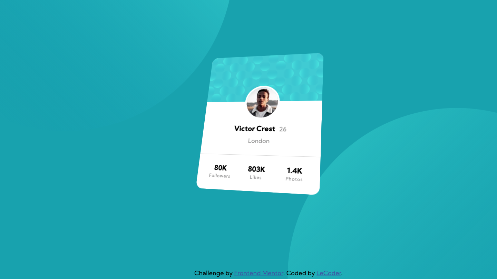

## Table of contents

- [Overview](#overview)
  - [The challenge](#the-challenge)
  - [Screenshot](#screenshot)
  - [Links](#links)
- [My process](#my-process)
  - [Built with](#built-with)
  - [What I learned](#what-i-learned)
  - [Continued development](#continued-development)
  - [Useful resources](#useful-resources)

## Overview

### The challenge

- Fun challenge for a shy newbie as me. Made me realise I still have a lot to learn to be able to do ALL by myself.

### Screenshot

### Links

- Solution URL: [Add solution URL here](https://your-solution-url.com)
- Live Site URL: [Add live site URL here](https://your-live-site-url.com)

## My process

### Built with

- HTML5 markup
- CSS custom properties
- Flexbox

### What I learned

This was an amazing challenge to help me with my programming path. I still have a long way to go. This challenges will get me going.

### Useful resources

- [My learning Workshops](https://www.shecodes.io) -
- [Dev Ed - youtube](https://www.youtube.com/watch?v=XK7T3mY1V-w&t=1710s) - This is an amazing channel to learn more about programming
